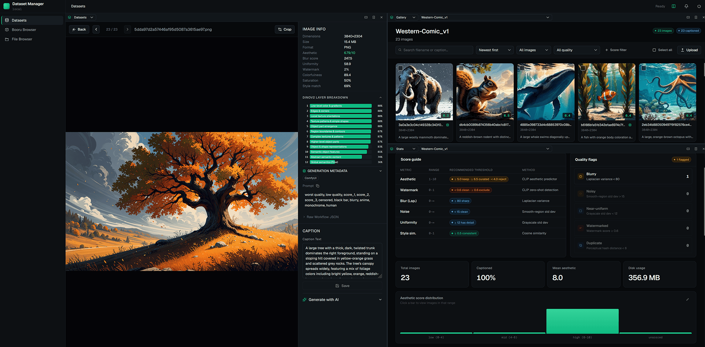
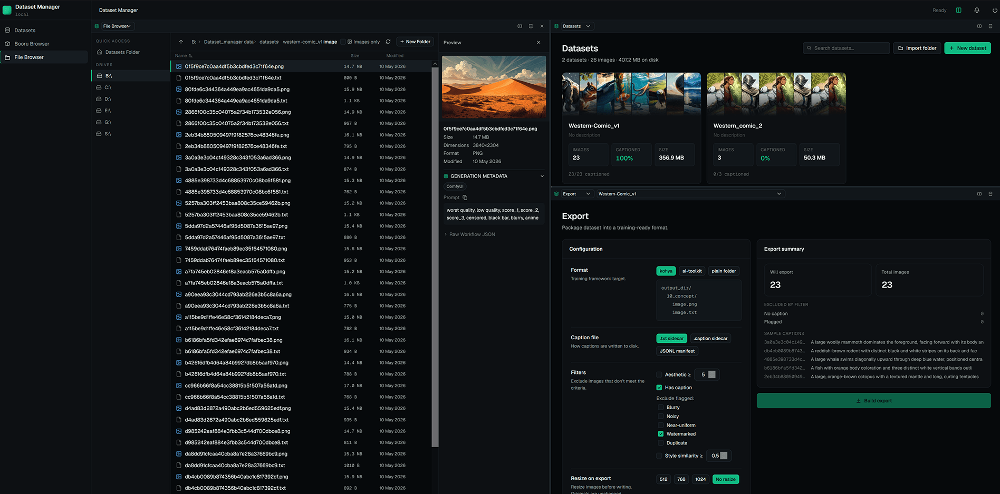

# Dataset-Manager

A web-based application for building, curating, and exporting Stable Diffusion training datasets. Manage your image collections with AI-powered captioning, multi-metric quality scoring, and flexible export to the most common training formats.


## What it does

Dataset-Manger gives you a single interface to go from raw image folders to a clean, captioned, scored, and filtered training dataset ready to drop into Kohya SS, AI Toolkit, or any other training framework.

- **Import** images from local folders into named datasets
- **Caption** images in batch using local ML models (Florence-2, PaliGemma-2, Ollama)
- **Score** every image across aesthetic quality, technical quality, watermark detection, and style similarity
- **Filter & curate** via search, quality flags, and score ranges
- **Batch edit** captions, tags, crops, and resizes across selected images
- **Browse** your filesystem, preview generation metadata, and import directly into datasets
- **Look up** booru tags to build tag vocabularies for your training subjects
- **Export** to Kohya, AI Toolkit, or plain folder format with per-export filtering and resizing
- **Split view** — run any pages side-by-side in independently scrollable panes, can be split multiple times.

All long-running operations (import, captioning, scoring, export) run in a background job queue and stream real-time progress to the UI via SSE.






---

## Features

### Datasets & Gallery
- Create multiple named datasets, each pointing to a folder of images
- Rename datasets — folder is moved on disk and all image paths are updated automatically
- Gallery view with search (filename or caption text), pagination, and sort
- Filter by caption status, quality flags, score ranges, aspect ratio, file size, and format
- Drag-and-drop image files onto the gallery to add them to the dataset
- Per-image detail view with metadata, caption editor, tag editor, and crop/rotate tools
- **Generation Metadata** — PNG metadata from AUTOMATIC1111 and ComfyUI workflows is extracted at import and displayed per-image: prompt, negative prompt, model, sampler, steps, CFG scale, seed, VAE, size, and optional raw ComfyUI workflow JSON

### AI Captioning
Batch-caption any selection of images using one of three backends:

| Model | VRAM | Notes |
|---|---|---|
| **Ollama**  | varies | Points to a local Ollama instance on `localhost:11434` |
| **Florence-2** | ~5.5 GB | Styles: short, detailed, tags, dense, promptgen |
| **PaliGemma-2 3B** | ~6 GB | Requires HuggingFace token; styles: short, detailed, tags, booru |

Caption post-processing options:
- Merge existing tags into the generated caption
- Strip common AI refusal phrases automatically
- Back up the original `.txt` sidecar before overwriting
- **Target resolution preprocessing** — center-crop and resize images to a target aspect ratio before inference so captions describe the composition the model will actually see at training time

**Prompt Preset Manager** — save and reload named combinations of model, style, and custom prompt text so you can reproduce captioning runs without re-entering settings.

### Batch Operations
Select any images in the gallery to perform bulk actions:

- **Batch caption** — run any captioning model on the selection with all the same options as the full-dataset run
- **Batch score** — run technical, aesthetic, watermark, and/or embedding scoring on the selection
- **Batch crop** — crop selected images to a target aspect ratio (center, top-left, or custom anchor)
- **Batch resize** — resize the longest side of selected images to a target pixel count (downscale only)
- **Batch tag operations** — add tags to, remove tags from, or completely replace the tag list on selected images
- **Caption find-replace** — regex-capable search-and-replace across caption text for a whole dataset or a selection
- **Bulk delete** — remove selected images from the dataset and disk

### Quality Scoring

| Scorer | Metrics | GPU |
|---|---|---|
| **Technical** | Blur (Laplacian variance), noise (smooth-region std dev), uniformity (grayscale std dev), color, saturation | CPU only |
| **Aesthetic** | Aesthetic score 1–10 (LAION Aesthetic Predictor v2.5), watermark score 0–1 (CLIP zero-shot), CLIP embeddings | ~3.5 GB VRAM |
| **DINOv2** | 768-dim final-layer embedding + all 12 transformer-layer CLS tokens for per-layer style analysis | ~1.2 GB VRAM |
| **Style Similarity** | Cosine similarity against reference images using stored embeddings | CPU only |
| **Duplicate Detection** | Perceptual hash (pHash) grouping | CPU only |

**Style similarity modes:**

| Mode | Description |
|---|---|
| `clip` | Cosine similarity of CLIP ViT-L-14 embeddings |
| `dino` | Cosine similarity of DINOv2 final-layer (or any of 12 layers) embeddings |
| `combined` | Weighted blend: 38% CLIP + 62% DINOv2 — best overall style consistency signal |
| `dino_all_layers` / `combined_all_layers` | Score each of the 12 DINOv2 layers independently and store all results |

Quality flags are set automatically when metrics cross thresholds:

| Flag | Threshold |
|---|---|
| `is_blurry` | Laplacian variance < 80 |
| `is_noisy` | Noise std dev > 15 |
| `is_uniform` | Grayscale std dev < 12 |
| `has_watermark` | CLIP watermark score ≥ 0.6 |
| `is_duplicate` | pHash match with another image in the dataset |

**Model unload** — a button in the Quality page frees a loaded model's VRAM without restarting the server, useful when switching between captioning and scoring.

### Statistics Dashboard
- 13+ interactive histograms: aesthetic, blur, noise, uniformity, color, saturation, watermark, megapixels, file size, caption length, style similarity, aspect ratio, quality flags
- Editable histogram bucket edges — rebucketing runs entirely client-side
- Top-500 tag frequency chart and tag co-occurrence matrix
- Click any histogram bar to open a filtered thumbnail grid

### Export
Three fully implemented export formats, all with identical filter and processing options:

| Format | Use case |
|---|---|
| **Kohya** | Kohya SS LoRA / full fine-tune training |
| **AI Toolkit** | AI Toolkit training |
| **Plain folder** | Any other framework (`images/` + `captions.jsonl` + `tags.csv`) |

Per-export options:
- Minimum aesthetic score filter
- Captioned-only filter
- Per-flag exclusions (blurry, noisy, uniform, watermarked, duplicate)
- Minimum style similarity filter
- Image format conversion (original / JPEG with quality setting)
- Resize longest side (downscale only)
- Caption sidecar format: `.txt`, `.caption`, or single `captions.jsonl`
- **Live export preview** — shows exact will-export and excluded counts (broken down by filter reason) before you run

### File Browser
A three-panel filesystem explorer built into the app:

- Left panel: drive roots + quick-access shortcut to the datasets folder
- Centre panel: breadcrumb navigation, sortable file list (name / size / date), images-only toggle, context menu (rename / delete / import into dataset)
- Right panel: image preview + dimensions/format/size metadata + generation metadata (A1111 / ComfyUI)
- Create folders, rename files and directories, delete items (syncs DB records automatically)
- Import any folder of images directly into an existing dataset without leaving the browser

### Booru Tag Lookup
Search booru image boards for tag vocabulary when building tag lists for your training subjects:

- Searches **Safebooru** (SFW) or **Gelbooru** (requires API key + user ID in `.env`)
- Shows tag name, category (character / artist / copyright / general / meta), and post count
- Configurable result limit (20 / 50 / 100); results cached for 5 minutes
- Copy individual tags or the full list to clipboard

### Split View
Split the main content area into two independently operating panes:

- Toggle via the **Columns** icon in the top-right toolbar
- Split any pane horizontally or vertically with the split buttons in the pane header
- Each pane has its own page selector and dataset selector — run Gallery in one pane and Stats in another, for example
- Drag the resize handle between panes to adjust the split ratio
- Close a pane to return to single-view

---

## Prerequisites

### Required
- **Windows 10/11** — setup and launch scripts are PowerShell; the backend and frontend are otherwise cross-platform
- **Python 3.10+**
- **Node.js 18+**

### For ML inference (captioning and aesthetic/DINOv2 scoring)
- **NVIDIA GPU with CUDA support**
- Minimum ~6 GB VRAM for a single captioning model; 8–12 GB recommended for comfortable use
- The technical scorer and duplicate detector run on CPU with no GPU requirement

### Optional
- **Ollama** installed and running locally (`localhost:11434`) to use Ollama-based captioning models
- **HuggingFace account** with a token (`HF_TOKEN`) to use PaliGemma-2 (requires accepting the model license at huggingface.co)
- **Gelbooru API key + user ID** for Gelbooru tag fetching (Safebooru works without a key)

---

## Supported Operating Systems

| OS | Status |
|---|---|
| Windows 10 / 11 | Fully supported |
| Linux / macOS | Backend and frontend are cross-platform, but the setup and launch scripts are PowerShell only — you would need to adapt them manually, might add later. |

---

## Installation

```powershell
# Clone the repository
git clone https://github.com/Blandmarrow/Dataset-manager
cd Dataset-manager
```

Then double-click **`Setup Dataset Manager.bat`** to create the virtual environment, install all dependencies, and build the frontend. The window stays open so you can see the output.

Copy `.env.example` to `.env` and fill in any optional values:

```env
HF_TOKEN=hf_...           # Required for PaliGemma-2
GELBOORU_API_KEY=...      # Optional, for Gelbooru tag fetching
GELBOORU_USER_ID=...
```

---

## Usage

Double-click **`Start Dataset Manager.bat`** in Explorer to launch the app. It opens on `http://localhost:8000` automatically.

To update to the latest version, double-click **`Update Dataset Manager.bat`** — it pulls the latest code, updates dependencies, and rebuilds the frontend.

To shut down, click the power icon in the top-right of the app and confirm, or press `Ctrl+C` in the terminal.

---

## Tech Stack

**Backend:** Python · FastAPI · SQLAlchemy (async) · SQLite · Alembic · Pillow · OpenCV · PyTorch · Transformers · OpenCLIP

**Frontend:** React 19 · TypeScript · Vite · TanStack Query · Zustand · Tailwind CSS · Recharts
