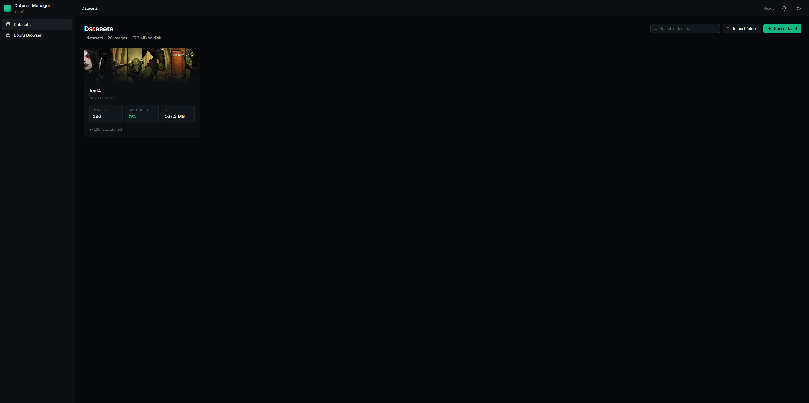
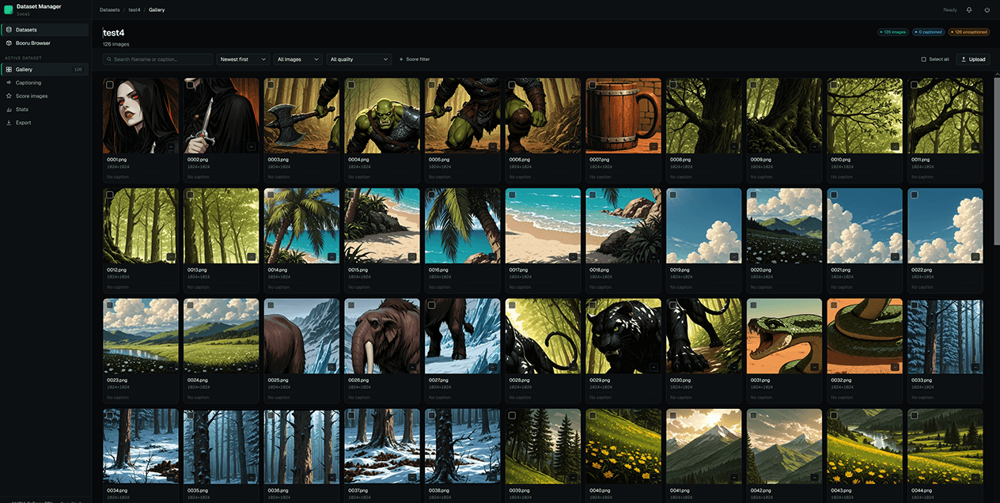
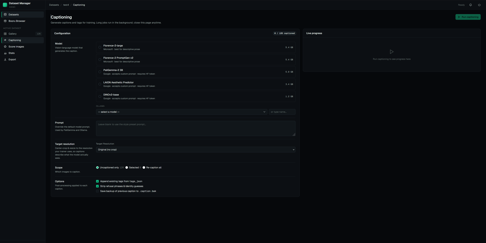
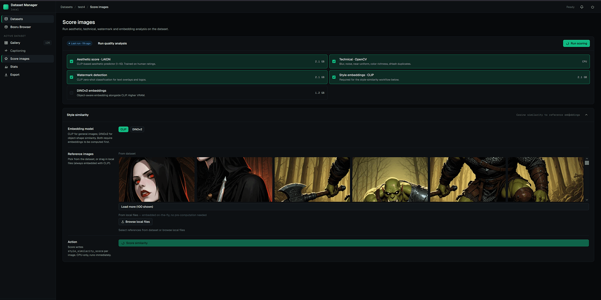
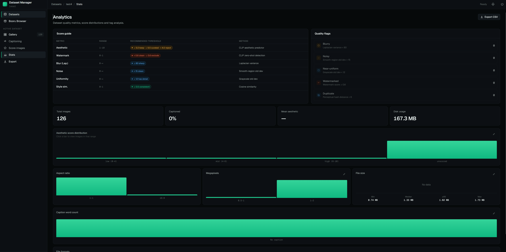
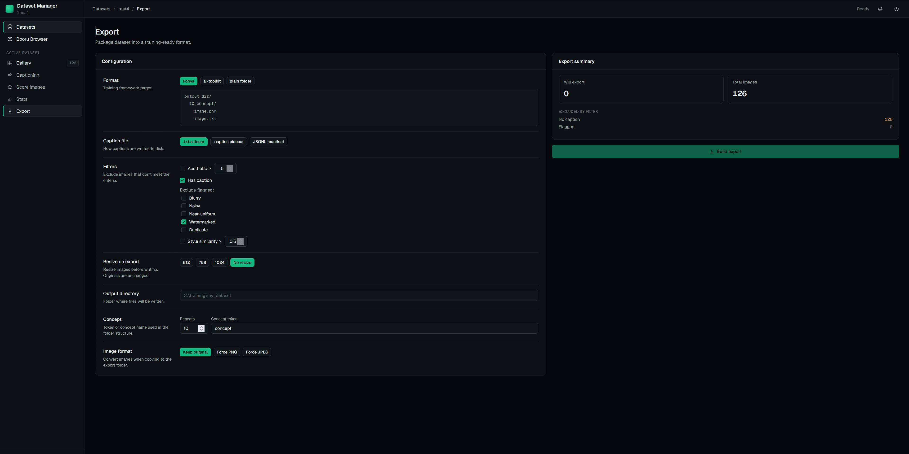

# Dataset-Manager

A web-based application for building, curating, and exporting Stable Diffusion training datasets. Manage your image collections with AI-powered captioning, multi-metric quality scoring, and flexible export to the most common training formats.








---

## What it does

Dataset-Manger gives you a single interface to go from raw image folders to a clean, captioned, scored, and filtered training dataset ready to drop into Kohya SS, AI Toolkit, or any other training framework.

- **Import** images from local folders into named datasets
- **Caption** images in batch using local ML models (Florence-2, PaliGemma-2, Ollama)
- **Score** every image across aesthetic quality, technical quality, watermark detection, and style similarity
- **Filter & curate** via search, quality flags, and score ranges
- **Export** to Kohya, AI Toolkit, or plain folder format with per-export filtering and resizing

All long-running operations (import, captioning, scoring, export) run in a background job queue and stream real-time progress to the UI via SSE.

---

## Features

### Datasets & Gallery
- Create multiple named datasets, each pointing to a folder of images
- Gallery view with search (filename or caption text), pagination, and sort
- Filter by caption status, quality flags, score ranges, aspect ratio, file size, and format
- Per-image detail view with metadata, caption editor, tag editor, and crop/rotate tools

### AI Captioning
Batch-caption any selection of images using one of three backends:

| Model | VRAM | Notes |
|---|---|---|
| **Ollama**  | varies | Points to a local Ollama instance on `localhost:11434` |
| **Florence-2** | ~5.5 GB | Styles: short, detailed, tags, dense, promptgen |
| **PaliGemma-2 3B** | ~6 GB | Requires HuggingFace token; styles: short, detailed, tags, booru |

Caption post-processing options:
- Merge existing tags into the generated caption
- Strip common AI refusal phrases automatically
- Back up the original `.txt` sidecar before overwriting
- Optional target resolution preprocessing — center-crop and resize images to a target aspect ratio before inference so captions describe the composition the model will actually see at training time

### Quality Scoring

| Scorer | Metrics | GPU |
|---|---|---|
| **Technical** | Blur (Laplacian variance), noise (smooth-region std dev), uniformity (grayscale std dev), color, saturation | CPU only |
| **Aesthetic** | Aesthetic score 1–10 (LAION Aesthetic Predictor v2.5), watermark score 0–1 (CLIP zero-shot), CLIP embeddings | ~3.5 GB VRAM |
| **DINOv2** | 768-dim embedding for style-consistency analysis | ~1.2 GB VRAM |
| **Style Similarity** | Cosine similarity against reference images using stored embeddings | CPU only |
| **Duplicate Detection** | Perceptual hash (pHash) grouping | CPU only |

Quality flags are set automatically when metrics cross thresholds:

| Flag | Threshold |
|---|---|
| `is_blurry` | Laplacian variance < 80 |
| `is_noisy` | Noise std dev > 15 |
| `is_uniform` | Grayscale std dev < 12 |
| `has_watermark` | CLIP watermark score ≥ 0.6 |
| `is_duplicate` | pHash match with another image in the dataset |

### Statistics Dashboard
- 13+ interactive histograms: aesthetic, blur, noise, uniformity, color, saturation, watermark, megapixels, file size, caption length, style similarity, aspect ratio, quality flags
- Editable histogram bucket edges — rebucketing runs entirely client-side
- Top-500 tag frequency chart and tag co-occurrence matrix
- Click any histogram bar to open a filtered thumbnail grid

### Export
Three fully implemented export formats, all with identical filter and processing options:

| Format | Use case |
|---|---|
| **Kohya** | Kohya SS LoRA / full fine-tune training |
| **AI Toolkit** | AI Toolkit training |
| **Plain folder** | Any other framework (`images/` + `captions.jsonl` + `tags.csv`) |

Per-export options:
- Minimum aesthetic score filter
- Captioned-only filter
- Per-flag exclusions (blurry, noisy, uniform, watermarked, duplicate)
- Minimum style similarity filter
- Image format conversion (original / JPEG with quality setting)
- Resize longest side (downscale only)
- Caption sidecar format: `.txt`, `.caption`, or single `captions.jsonl`
- Live export preview showing exact include/exclude counts before you run

---

## Prerequisites

### Required
- **Windows 10/11** — setup and launch scripts are PowerShell; the backend and frontend are otherwise cross-platform
- **Python 3.10+**
- **Node.js 18+**

### For ML inference (captioning and aesthetic/DINOv2 scoring)
- **NVIDIA GPU with CUDA support**
- Minimum ~6 GB VRAM for a single captioning model; 8–12 GB recommended for comfortable use
- The technical scorer and duplicate detector run on CPU with no GPU requirement

### Optional
- **Ollama** installed and running locally (`localhost:11434`) to use Ollama-based captioning models
- **HuggingFace account** with a token (`HF_TOKEN`) to use PaliGemma-2 (requires accepting the model license at huggingface.co)
- **Gelbooru API key + user ID** for Booru tag fetching

---

## Supported Operating Systems

| OS | Status |
|---|---|
| Windows 10 / 11 | Fully supported |
| Linux / macOS | Backend and frontend are cross-platform, but the setup and launch scripts are PowerShell only — you would need to adapt them manually, might add later. |

---

## Installation

```powershell
# Clone the repository
git clone https://github.com/Blandmarrow/Dataset-manager
cd Dataset-manager

# First-time setup: creates venv, installs dependencies, builds frontend
.\setup.ps1
```

Copy `.env.example` to `.env` and fill in any optional values:

```env
HF_TOKEN=hf_...           # Required for PaliGemma-2
GELBOORU_API_KEY=...      # Optional, for Booru tag fetching
GELBOORU_USER_ID=...
```

---

## Usage

```powershell
# Start the production server (runs on http://localhost:8000)
.\start.ps1

# Start in development mode (backend :8000 + Vite frontend :5173 with hot reload)
.\start_dev.ps1
```

Open your browser to `http://localhost:8000` (or `http://localhost:5173` in dev mode).

To shut down, click the power icon in the top-right of the app and confirm, or press `Ctrl+C` in the terminal.

---

## Tech Stack

**Backend:** Python · FastAPI · SQLAlchemy (async) · SQLite · Alembic · Pillow · OpenCV · PyTorch · Transformers · OpenCLIP

**Frontend:** React 19 · TypeScript · Vite · TanStack Query · Zustand · Tailwind CSS · Recharts
